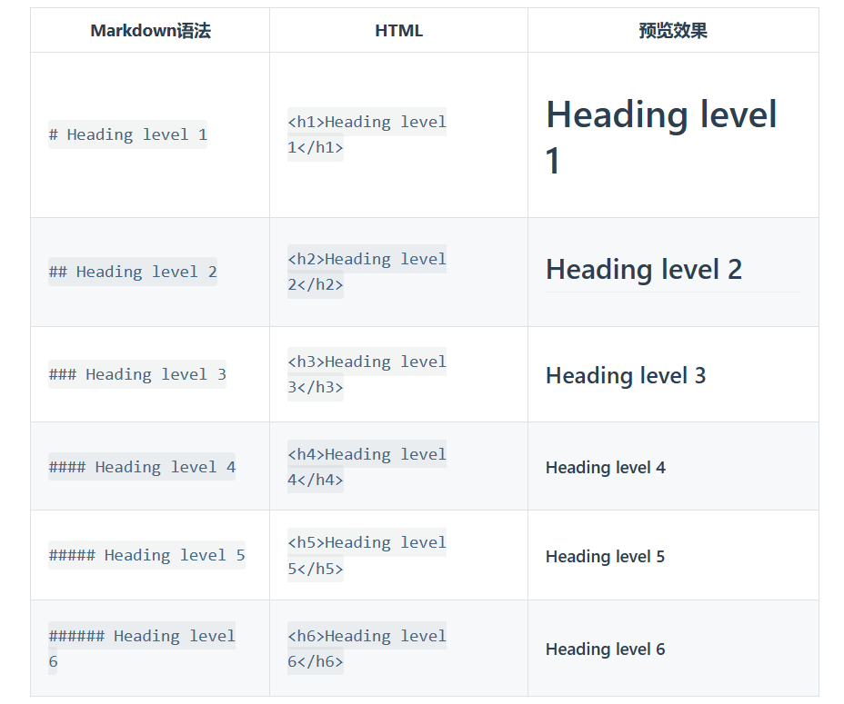
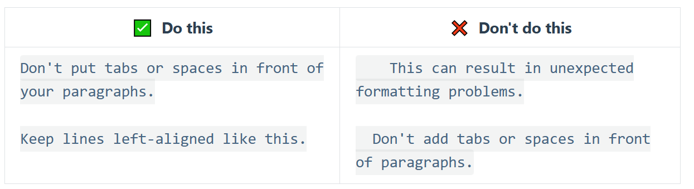
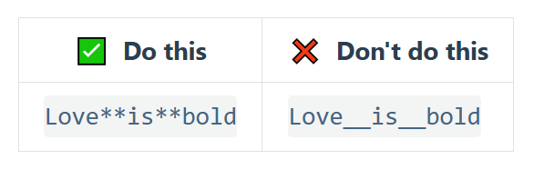
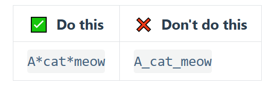
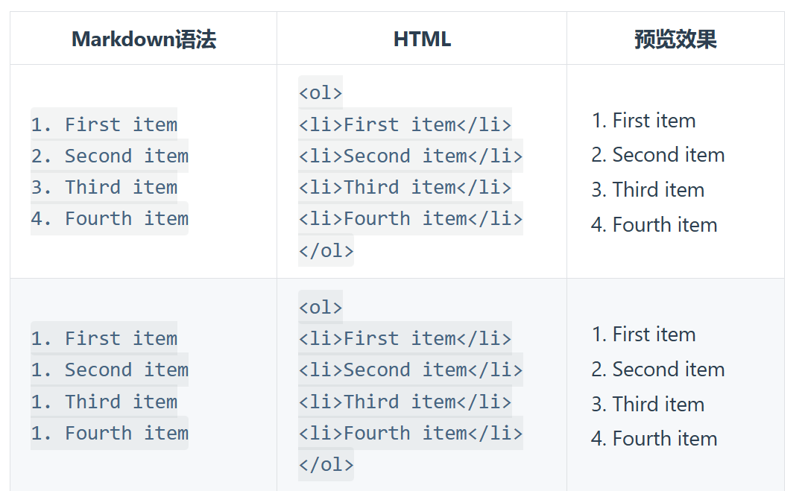
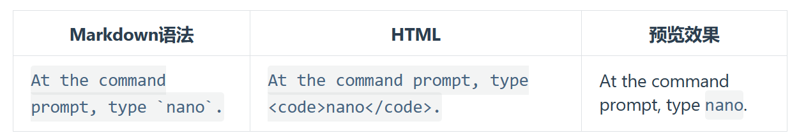

Markdown是一种轻量级标记语言，排版语法简洁，让人们更多地关注内容本身而非排版。

[TOC]


# 基本语法 

###### 1、要创建标题，在单词或短语前面添加井号 。`#` 的数量代表了标题的大小



为了兼容考虑，请用一个空格在 `#` 和标题之间进行分隔。

###### 2、要创建段落，请使用空白行将一行或多行文本进行分隔



不要用空格（spaces）或制表符（ tabs）缩进段落  

###### 3、要加粗文本，请在单词或短语的前后各添加两个星号（asterisks）



为兼容考虑，在单词或短语中间部分加粗的话，请**使用星号**（asterisks）

要高亮表示用四个等号,空白处填内容

例如==   ==   

###### 4、要用斜体显示文本，请在单词或短语前后添加一个星号（asterisk）*中间不要带空格*



###### 5、要创建块引用，请在段落前添加一个 `>` 符号

> abc
>
> > def
> >
> > > gh

###### 6、可以将多个条目组织成有序或无序列表

创建有序列表:请在每个列表项前添加数字并紧跟一个英文句点。数字不必按数学顺序排列，但是列表应当以数字 1 起始



1. abc

   1. a

   2. b

2. cde

3. ghi
   1. g
   2. h
   3. i

4. asdhk

**注释** ：要在“ .”和“abc”之间加个空格,一直按回车退出列表

创建无序列表：请在每个列表项前面添加破折号 (-)、星号 (*) 或加号 (+) 。缩进一个或多个列表项可创建嵌套列表

* abc
* cde 
* ashdk
  + shdj
  + sdjka
  + kdaslj

创建任务列表:用-[]来创建，其中-和[]之间有空格

- [ ] abc
- [ ] def
- [ ] sakdjhsak

###### 7、代码语法

要将单词或短语表示为代码，请将其包裹在反引号 (`) 中



转义反引号 例如  ``use`code` in your file ``

要创建代码块，请将代码块的每一行缩进至少四个空格或一个制表符。

```python
print(hello)
```

==代码块使用方法==：三个反引号后＋对应语言

例如：```python  

例如：```c

###### 8、数学公式

用四个$$    $$ 表示


$$
y = x^2
$$
9、表格（Ctrl+T）


10、表情

###### win+句号 👀

------


----

水平分割线：三个减号 ---

---

[百度]: https://www.baidu.com


